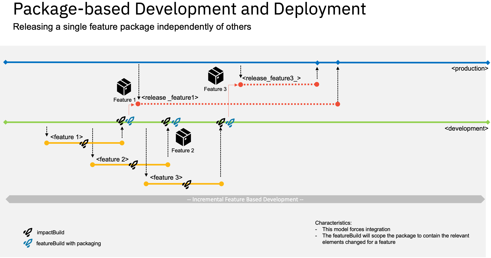

# Generate a Release Branch with the Commits of an Particular Feature  

This sample automatically creates a release branch with the modifications of the scope of a single feature. It cherry-picks the changes from the **development branch**, which got merged into it from a feature branch.  

It allows to implement a feature based development and delivery process, by scoping a package based on the modifications of a feature branch.  

Additional coordination is required to serve dependencies between features.

The script is intended to be implemented as a post-build script for a **featureBuild**.

Please use this with care.



## Steps

### Generating

1. The script will first read the build report, which is passed in via the `--workDir` option. It expects that the BuildReport contains records of the `DBB.FeatureBuildInfo` which contain the references to the merge commits for a particular feature. 
2. Clones the repository into the workspace and checkout the `baseline branch` , typically PROD or MAIN, which represents the contents of the production runtime.
3. Creates a new branch which name is passed in through the `gitBranch` option.
4. It now iterates through the list of Merge Commits from the BuildReport and _cherry picks_ the commits.
5. Finally it pushes the changes back to the git server.

### Sample output

```
+ /usr/lpp/dbb/v1r0/bin/groovyz /var/dbb/extensions/git-cherryPickFeatureCommits/git-cherrypick-feature.groovy --gitUrl git@github.ibm.com:dennis-behm/dbb-zappbuild-1.git --workDir /var/jenkins/workspace/MortgageApplication_packaging/BUILD-76/build.20210803.124924.049 --repositoryPath /var/jenkins/workspace/MortgageApplication_packaging/Feature_Release --baselineBranch production --gitBranch release_issue109_76_20210803.014912.049 
+ GIT_SSH_COMMAND=ssh -i $SSH_KEY 
** Cherry Pick Commits start at 20210803.124936.049
** Properties at startup:
   gitBranch -> release_issue109_76_20210803.014912.049
   repositoryPath -> /var/jenkins/workspace/MortgageApplication_packaging/Feature_Release
   gitUrl -> git@github.ibm.com:dennis-behm/dbb-zappbuild-1.git
   startTime -> 20210803.124936.049
   workDir -> /var/jenkins/workspace/MortgageApplication_packaging/BUILD-76/build.20210803.124924.049
   baselineBranch -> production
** Read build report data from /var/jenkins/workspace/MortgageApplication_packaging/BUILD-76/build.20210803.124924.049/BuildReport.json
** Initialize Git Environment for release branch for feature
 * Create branch release_issue109_76_20210803.014912.049 and check it out. 
** Find DBB.FeatureBuildInfo in the build report to obtain the Merge Commits
 * gitCherryPick: 	 3bd0797ad6475d6069b1b6c28494d8e51cb9e66e  	  Merge pull request #53 from dennis-behm/issue109  	  [samples/MortgageApplication/cobol/epsmpmt.cbl, samples/MortgageApplication/cobol/epsmlist.cbl, samples/MortgageApplication/link/epsmlist.lnk]
** Push release branch for feature back to central git provider.
* Cherry-Picking Process completed.
** Build finished
```

## Invocation 

The script does not manage credentials itself, but requires them to be passed from the environment.

### Sample Invocation from a Jenkins pipeline 

The below Jenkinsfile leverages the withCredentials Plugin in Jenkins to retrieve the SSH Key from the Jenkins credentials provider.

For more details please see [Jenkins Credential Binding] (https://www.jenkins.io/doc/pipeline/steps/credentials-binding/#withcredentials-bind-credentials-to-variables)

The below sample leverages a patched Jenkins Credential Binding Plugin, while we identified an issue with the encoding on USS. A PR is raised here at and we are waiting for the merge.
https://github.com/jenkinsci/credentials-binding-plugin/pull/146

```
DBB Build
.... 

	stage('Create Feature-Release Git Branch and Cherry-Pick FeatureCommits') {
		dir ('Feature_Release') {
			deleteDir()

			withCredentials(bindings: [
				sshUserPrivateKey(credentialsId: gitCredId, keyFileVariable: 'SSH_KEY')
			]) {
			
//			echo "----iconv sshkey ------"
//			sh('iconv -f utf-8 -T -t IBM-1047 $SSH_KEY > $SSH_KEY.tmp')
//			sh('chmod 600 $SSH_KEY')
//			sh('mv $SSH_KEY.tmp $SSH_KEY')
//			sh('chmod 400 $SSH_KEY')
			
			def gitURL='git@github.ibm.com:dennis-behm/dbb-zappbuild-1.git'
			def baselineBranch='production'
			
			sh ('GIT_SSH_COMMAND=\'ssh -i $SSH_KEY\' '+ "/usr/lpp/dbb/v1r0/bin/groovyz /var/dbb/extensions/git-cherryPickFeatureCommits/git-cherrypick-feature.groovy --gitUrl $gitURL --workDir ${WORKSPACE}/BUILD-${BUILD_NUMBER}/${BUILD_OUTPUT_FOLDER} --repositoryPath ${WORKSPACE}/Feature_Release --baselineBranch $baselineBranch --gitBranch $feature_releaseBranch")
							
			}
		}
	}
...
```